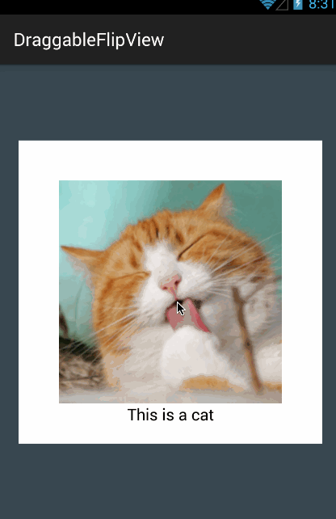
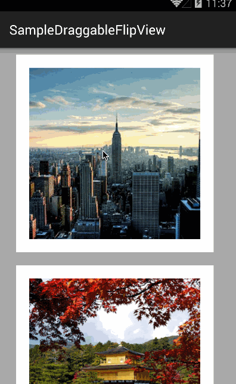

# DraggableFlipView
[](https://www.apache.org/licenses/LICENSE-2.0)
[](https://bintray.com/sasakicks/maven/DraggableFlipView/_latestVersion)
[](http://android-arsenal.com/details/1/2509)
[](http://www.android-gems.com/lib/sasakicks/DraggableFlipView)

An Android View library that flips while dragging.




The reason why I made this library is that I wanted to display simple information without leaving the screen.  
Make use of this library for your imagination freely!!!




# Gradle
```
compile 'com.github.sasakicks:draggable-flipview:1.0.0'
```

# How To Use
1. Add DraggableFlipView widget to your layout.  
2. Configure two layouts to show front view and back view, just like the code below:

```xml
<com.github.sasakicks.draggableflipview.DraggableFlipView
    android:id="@+id/draggable_flip_view"
    android:layout_width="@dimen/layout_size"
    android:layout_height="@dimen/layout_size"
    app:frontView="@layout/view_front"
    app:backView="@layout/view_back"
    />
```

# Attributes

|attribute name|description|
|:-:|:-:|
|frontView|Layout of front view|
|backView|Layout of back view|
|dragDetectAngle|Angle of detecting to flip view|
|draggableAngle|Angle of the limit to drag |

# License
```
Copyright (C) 2015 sasakicks
Copyright (C) 2013 The Android Open Source Project

Licensed under the Apache License, Version 2.0 (the "License");
you may not use this file except in compliance with the License.
You may obtain a copy of the License at

http://www.apache.org/licenses/LICENSE-2.0

Unless required by applicable law or agreed to in writing, software
distributed under the License is distributed on an "AS IS" BASIS,
WITHOUT WARRANTIES OR CONDITIONS OF ANY KIND, either express or implied.
See the License for the specific language governing permissions and
limitations under the License.
